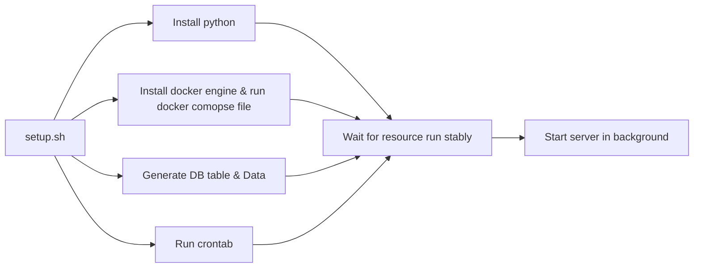
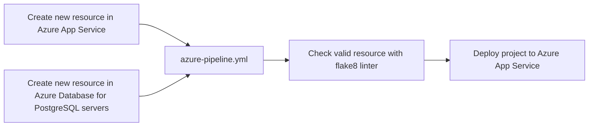

# Table of contents

- [Week 3](#week-3-learn-linux-os-and-shell-scripting)
- [Week 4](#week-4-learn-networking-and-security)

# Week 3 Learn Linux OS And Shell Scripting

## Install package and setup environment and run setup cron jobs for `dumpuser_service` 

### Flowchart



#### Python
Install require python version for running server (OS: Ubuntu, Python version: >=3.10)
Set default python version to require version
Install dependency packages
```
    apt install python3.10 -y

    # Update default python version
    update-alternatives --install /usr/bin/python3 python3 /usr/bin/python3.10 1
    update-alternatives --config python3

    # Install pip3 and dependencies package
    apt-get install python3-pip -y
    pip3 install --no-cache-dir --upgrade -r requirements.txt
```

#### Docker
Install docker engine and create container for postgresql database
`Docker compose file`
```
    # Use postgres/example user/password credentials
    version: '3.1'

    networks:
      postgres_net:
        name: postgres_net

    services:

      postgres:
        image: postgres
        networks:
          - postgres_net
        restart: always
        environment:
          POSTGRES_USER: <username>
          POSTGRES_PASSWORD: <password>
          POSTGRES_DB: dumpuser_service
        ports:
          - 5432:5432
```

#### Database
Healthcheck database and initialize data with initialize_db_data.py script

#### Server
Start server and log stdout and stderr to log file in background
`python3 -m gunicorn main:app --bind 0.0.0.0:8080 -w 6 -k uvicorn.workers.UvicornWorker > /var/log/dumpuser_service.log 2>&1 &`

#### Crontab
Crontab run /scheduler.sh scripts and scheduler.sh call to python file activate_scheduler.py

`Crontab script`
```
    SHELL=/bin/bash
    PATH=/usr/local/sbin:/usr/local/bin:/usr/sbin:/usr/bin:/sbin:/bin

    */2 * * * * bash /scheduler.sh > /var/log/activate_scheduler.log 2>&1
```

`Bash script`
```
    #!/bin/bash

    /usr/bin/python3 /ntd-dxc/activate_dumpuser.py
```

# Week 4: Learn Networking And Security

## Setup CI/CD deploy `dumpuser_service` to azure app service (Azure Devops Pipeline)

### Flowchart



#### Configure pipeline in Azure Devops
Trigger pipeline on change branch `main`, pipeline will run LinterCheckPipeline first,
DeploymentPipeline depends on LinterCheckPipeline, it will be triggered when LinterCheckPipeline is
succeeded

#### Pipeline Workflows

##### LinterCheckPipeline

```
jobs:
  - job: linter_check
    displayName: Flake8 Linter
    steps:

    - task: UsePythonVersion@0
      inputs:
        versionSpec: '3.10'
      displayName: 'Use Python 3.10'

    - script: |
        curl -sSL https://install.python-poetry.org | python3 -
        echo "##vso[task.setvariable variable=PATH]${PATH}$HOME/.local/bin"
        poetry install --no-root
      displayName: Install dependencies

    - script: |
        poetry run flake8 .
      displayName: 'Linter'
```

##### DeploymentPipeline
```
jobs:
  - job: Deploy
    dependsOn: linter_check
    condition: in(dependencies.linter_check.result, 'Succeeded', 'Skipped')
    displayName: Deploy to app service
    steps:

      - task: ArchiveFiles@2
        inputs:
          rootFolderOrFile: '$(System.DefaultWorkingDirectory)'
          includeRootFolder: false
          archiveType: 'zip'
          archiveFile: '$(Build.ArtifactStagingDirectory)/$(Build.BuildId).zip'

      - task: AzureWebApp@1
        inputs:
          azureSubscription: demo_cn
          appType: webAppLinux
          appName: dumpuser-service
          package: $(Build.ArtifactStagingDirectory)/$(Build.BuildId).zip # string. Required. Package or folder. Default: $(System.DefaultWorkingDirectory)/**/*.zip.
          startUpCommand: startup.sh # string. Optional. Use when appType = webAppLinux. Startup command. 
          deploymentMethod: zipDeploy # 'auto' | 'zipDeploy' | 'runFromPackage'. Required when appType != webAppLinux && appType != "" && package NotEndsWith .war && package NotEndsWith .jar. Deployment method. Default: auto.
```

## SAST Static Application Security Testing
Is a testing methodology that analyzes source code to find security vulnerabilities that make your organization’s applications susceptible to attack
## SCA Software composition analysis
Is an automated process that identifies the open source software in a codebase. This analysis is performed to evaluate security, license compliance, and code quality
## DAST Dynamic Application Security Testing
Is the process of analyzing a web application through the front-end to find vulnerabilities through simulated attacks. This type of approach evaluates the application from the “outside in” by attacking an application like a malicious user would

# Ex1
